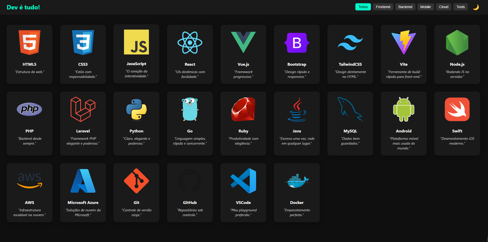
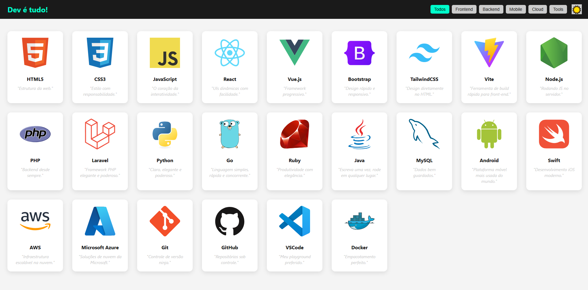
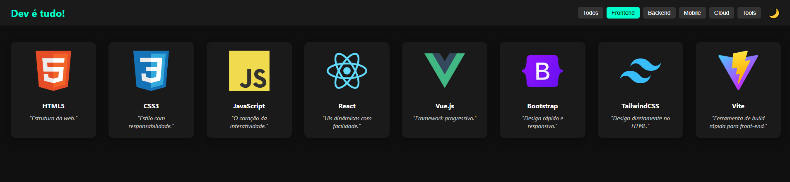

# Dev é Tudo!

<p align="center">
  
  <br>
  
  <br>
  
</p>

Projeto visual e interativo que reúne as principais tecnologias utilizadas no universo de desenvolvimento de software. Ideal para programadores iniciantes e experientes que desejam explorar rapidamente ferramentas, linguagens, frameworks e plataformas importantes no mercado.

---

## 🌟 Novidades na Atualização!

- **Nova categoria de Frameworks**: Filtro dedicado para todos os frameworks disponíveis
- **Categoria de Sistemas Operacionais (OS)**: Windows, Linux e macOS agora com cards próprios
- **Mais tecnologias adicionadas**:
  - Kotlin (Mobile)
  - Flutter (Framework)
  - Next.js (Framework)
  - Sublime Text (Tools)
  - C++ (Backend)
  - C# (Backend)
  - TypeScript (Frontend)
  - Spring (Framework)
  - Django (Framework)
  - React Native (Framework)
  - Phoenix (Framework)
  - Figma (Tools)
  - Webflow (Framework)
- **Correção de ícones**: SVG do Sublime Text substituído por versão funcional

---

## 🛠️ Tecnologias Utilizadas (Atualizado)

| Categoria | Tecnologias |
|-----------|-------------|
| **Frontend** | HTML5, CSS3, JavaScript, TypeScript |
| **Backend** | Node.js, PHP, Python, Go, Ruby, Java, MySQL, C#, C++ |
| **Mobile** | Android, Swift, Kotlin |
| **Cloud** | AWS, Microsoft Azure |
| **Tools** | Git, GitHub, VSCode, Docker, Sublime Text, Figma, Android Studio |
| **Frameworks** | React, Vue.js, Bootstrap, TailwindCSS, Vite, Laravel, Next.js, Spring, Django, Flutter, React Native, Phoenix, Webflow |
| **Sistemas Operacionais** | Windows, Linux, macOS |

---

## 🎨 Interface Aprimorada

- **Novos filtros**:
  - Frameworks
  - Sistemas Operacionais (OS)
- **Cards atualizados**:
  - Todos os novos cards seguem o mesmo padrão visual
  - Links oficiais para documentação de cada tecnologia
  - Descrições atualizadas e características principais
- **Ícones corrigidos**:
  - Sublime Text agora com ícone funcional
  - Todos os ícones provenientes de fontes confiáveis

---

## 📦 Como rodar localmente

1. Clone o repositório:
   ```bash
   git clone https://github.com/HardWareGCR/dev-e-tudo.git
   ```
2. Acesse a pasta do projeto:
   ```bash
   cd dev-e-tudo
   ```
3. Abra o arquivo `index.html` no seu navegador preferido

---

## 🛠️ Como contribuir

Contribuições são muito bem-vindas! Se quiser:
- Adicionar mais tecnologias
- Melhorar estilos 
- Adicionar novos recursos
- Corrigir problemas

Basta abrir uma PR 😊

**Dicas para contribuição**:
- Verifique se a tecnologia ainda não está listada
- Use ícones do [Devicon](https://devicon.dev/) quando disponível
- Mantenha o padrão de cards existente
- Inclua link para documentação oficial

---

## 📬 Contato

**Desenvolvido por Stalon_Augusto**  
🔗 LinkedIn: [Stallone Augusto](https://www.linkedin.com/in/stalone-augusto-0b7407289/)  
💻 GitHub: [@HardWareGCR](https://github.com/HardWareGCR)

---

## 🚀 Futuras Melhorias (Atualizado)

- **Armazenamento de preferência**: Salvar tema escolhido no localStorage
- **Menu lateral responsivo**: Para melhor navegação em dispositivos móveis
- **Filtros avançados**:
  - Por popularidade
  - Ano de lançamento
  - Nível de dificuldade
- **Estatísticas de uso**: Integrar API para mostrar ranking de popularidade
- **Versão PWA**: Transformar em aplicação progressiva (offline-first)
- **Tradução multi-idioma**: Adicionar suporte a inglês e espanhol
- **Sistema de busca**: Para encontrar tecnologias específicas rapidamente
- **Animações**: Efeitos suaves para transições entre temas e filtros

---

## 📄 Licença

Este projeto está licenciado sob a licença MIT - veja o arquivo [LICENSE](LICENSE) para detalhes.
